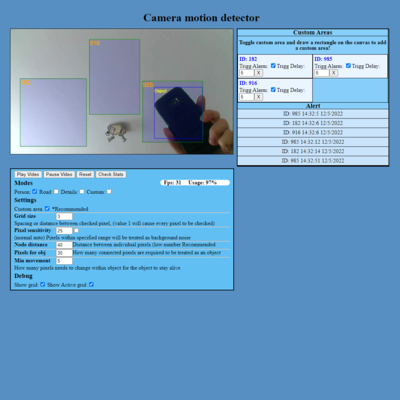

# Camera motion detector
#### A little project I was planing to make for sometime untill I finally managed to do it. 
#### Its made of js, no libraries, except WebRTC which is build into js I think.

You can demo it here https://nazar1000.github.io/

## What it can do:
- It can be used as a simple motion detector which can notify user by sound. (browser needs to be open)
- You can setup custom zones to check specific areas for movement.
- You can use it as a door bell, if you can point it at your door.

## Updates:

### Update 2
- Improved UI
- Added pixel noise balancer, 
- general code tweaks

### Update 1: As of the initial commit, the project is mostly working, however it is not perfect:

#### What it cannot do/lacks:
- [x] It does not currently have a instructions for how to use UI and what it does. (Added in update 2).
- [ ] It requres better algorythms to work well and ~~be self adjustable.~~ (Pixel noise balancer added in update 2).
- [x] It needs to be manually adjusted for noise caused by low brightness,~~ as well as initial setup. (Pixel noise balancer added in update 2)
- [ ] It does not remember previous settings, so it has to be setup each time. (Not yet implemented)
- [ ] It has hard coded camera resolution and is not compatible with mobiles. (Not yet improved))
- [ ] It does not track objects too well, just detects them.
- [ ] It has limited ability to collect data for a database (requires code tweaking).

